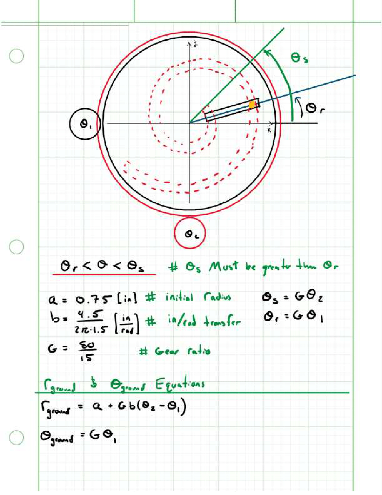
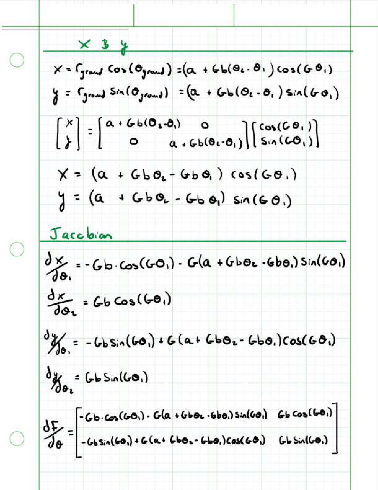
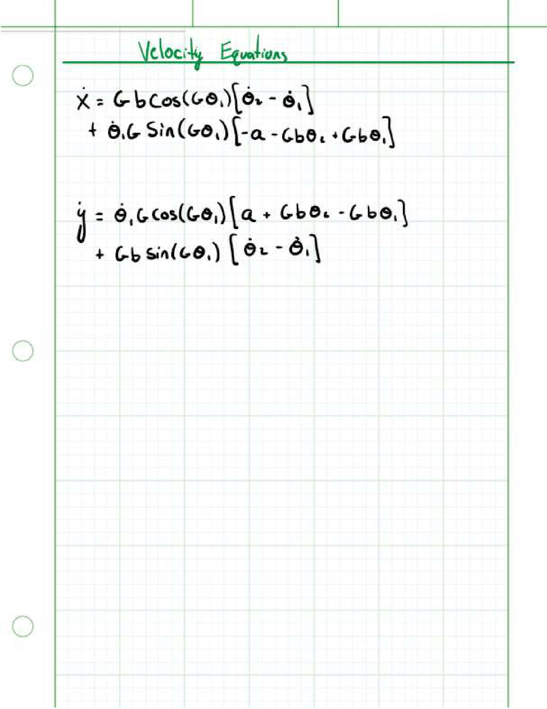
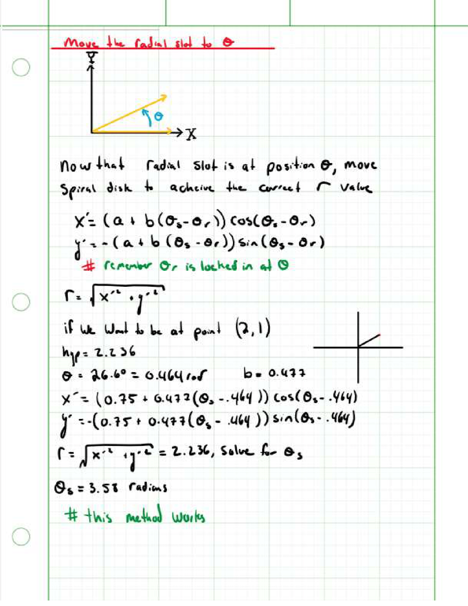

# ME 405 Mechatronics Pen Plotter Landing Page
#### Authors: Tim Matista, Jason Hu
#### Under the Guidance of: Professor Charlie Refvem, Cal Poly SLO
#### Date: 06/04/2022

## The Pen Plotter Project Definition
#### The Pen Plotter project was devised to allow teams to create a robotic drawing machine in any creative was possible. The requirements for this project were to create a 2-and-a-half degree of freedom robot that, when fed raw HPGL files, draws out shapes using any means necessary. The term "draw" was free to be interpreted in whatever manner we choose. The two main degrees of freedom are as well free to be chosen to be any motion EXCEPT the cartesian coordinate system. The remaining half degree of freedom is used as an actuator, or pen-up pen-down motion. 
#### All devices also must be able to be ran using benchtop power supplies in the laboratory and include a "Bell and Whistle" to uniquely define this project from any similar project done before. 

## Features
#### Our pen plotter design offers a large workspace and the radial symmetry of the system lends itself well to geometric patterened drawings. The pen plotter can raise and lower the pen to allow fo seperate shapes to be drawn.

## Bell-and-Whistle: Live Plotting
#### The additional feature added to our system is a live plotting system that uses UART to communicate drawing progress from the Nucleo to the computer. This requires a cable to be connected to the STLink in addition to the one plugged into the Shoe of Brian. To set up the live plotting, type "pip install panda" into the command prompt to download the necessary software. Then, run the plotting file by seelcting the appropriate directory and then commanding "python uart_draw.py". A window should open and display the curent pathing of the pen plotter. 

## Operation
#### To run the systme, start by saving a drawing as "simple.hpgl" to the Nucleo. Next, move the motors so that the gears are **not** meshed with the disks. This is important because the motors automatically move to their "home" position which may not be what you expect it to be. Next, ensure that the pen is in the raised position. If it isn't this can be manually adjusted by running the "simple.py". Slide a piece of paper under the disks, switch on both power supplies and soft reboot the Nucleo by pressing ctrl+D. The code will report when it has finished parsing your drawing into usable code and the motors may start moving to their home location. When all of this has finished, move the gears into place to mesh with the disks, and press any key to coninue.

## (ADD WIRING DIAGRAM HERE)
## (ADD TASK DIAGRAM HERE)

## Mecha15's Mechanical Design
#### Team Mecha15 decided to pursue a robot similar to mechanism 94 in the book, "507 Mechanical Movements". The proposed mechanism can be found here: http://507movements.com/mm_094.html
### The Discs
#### The proposed mechanism 94 operates using two discs, so we laser cut two discs out of HDPE that were donated by the Robotics Club at Cal Poly. The discs can be separated into a radial disc and a spiral disc. Both gears were cut to have a diameter of 14". 
### Spiral Disc
#### The spiral disc was laser cut out of HDPE at 1/4" thickness, it was designed to have an Archimedes spiral cut into it along with a 50 gear teeth on the outer diameter. Three triangular weight-saving shapes were cut into the spiral disc to cut down on inertial load and allow the user to view drawings below.
### Radial Disc
#### The radial disc was cut with a 4.75" radial slot in it to facilitate movement. This slot starts 0.75" away from the exact center of the disc. Circular weight-saving cuts were made in the radial disc to ease inertial load and allow the user to view drawings below. This disc is outfitted with a linear rail along its radial slot to help facilitate the motion of the pen as well as keep it upright. 
### Lazy Susans
#### Two 14" Lazy Susans (LS) were purchased from Amazon at about 17$/each. These LS are mounted between both discs to facilitate the independent movement of the discs. The discs were secured to the LS using hot glue. The LS can be found on Amazon here: https://www.amazon.com/dp/B07PW63B3Q/ref=twister_B09ZTWL4NN?_encoding=UTF8&th=1
### CAD
#### The Solidworks file used in the design of this project are included in this repository. The files corresponding to the disks and pinion gears were used to laser cut the respective parts.

## The Motors
### Steppers
#### Two Wantai NEMA 23 motors were chosen for the final design, as these motors are able to produce the torque needed to move both discs independently. These motors are configures in 4-wire bi-polar stepper movement and have 200 counts-per-revolution. These motors are mounted on brackets to elevate them to the desired height. Pinion gears with 15 teeth are attached to the output shafts of the motor and are designed to mesh with the radial and spiral discs gear teeth. 
### Servo
#### A single TowerPro hobby servo motor was selected to control the pen actuation. The motor was dissected and altered for manual control of the internal DC motor and potentiometer. The resistance of the potentiometer changes as the motor spins, and the reistsnace changes the reading of an ADC on the Nucleo. The servo is outfitted with a single cam on its output shaft that physically moves a pen up and down. All of this together allows the Nucleo to sense if the pen has successfuly been raised or lowered.

## The Drivers
#### Both NEMA 23 motors are driven using TMC4210 and TMC2208 driver chips. These chips were selected due to their SPI protocol and silentstepper modes of movement. These chips, along with a capacitor and header pins, were soldered to a prototyping board supplied by Charlie. This board then interfaces with the Shoe-Of-Brian mounted beneath the STM32 Nucleo Microcontroller. An exact pin-out description is as follows: 

| Motor Driver|    Nucleo |
|-------------|-----------|
| EN1         | C3        |
| EN2         | C2        |
| CLK         | C7        | 
| nCS1        | C0        |
| nCS2        | C4        |
| SCK         | B3        |
| MOSI        | MOSI2     |
| MISO        | MISO2     |

## Firmware
#### The software used to impliment the robot was written in Python, for its under-the-hood libaries make calculations, matrix operations and motor movement fairly easy. The software is split up into 10 files:
#### main.py
#### task_motor.py
#### newtonraphson.py
#### tmc4210driver.py
#### filereader.py
#### ihm04a1Driver.py
#### uart_draw.py
#### uarter.py
#### task_share.py
#### cotask.py

### main.py
#### The main file is responsible for scheduling and instantiating the tasks that run all the files described above. We opted with a round-robin scheduling instead of a priority scheduling technique to make sure each task had the opportunity to run. The scheduling for the running of each task is outlined in the table below. The motor task sends the desired position to each motor and them checks if the motors have reached that position. Note that the equation_task and theta_task run at the same period and priority. This would nomrally be a problem, but only one of these tasks can run at a time. These tasks are in chage of determining desired motor positions from either a .hpgl or from a mathmatical pattern, respecitvely. The pud_driver task is in chage fof raising and lowering the pen throughout the drawing process.

| Task Name     |  Period (ms) | Priority |
| ------------- | ------------ | -------- |
| motor_task    | 75           | 0        |
| theta_task    | 75           | 1        |
| equation_task | 75           | 1        |
| pud_driver    | 50           | 2        |

### filereader.py
#### This file takes in a raw .hpgl file, parses it, then saves each X, Y, and command coordinate to a .txt file. The command coordinate is simply either a 0 or a 1 corresponding to pen up/pen down respectively. This is done by seperating the .hpgl file at every semicolon, denoting different operations, and then by commas, denoting x and y coordinates. This file will also determine if the distance between two points is greater than a set threshold and interpolates between points as needed. This file will also determine if the requested point is within the workspace that the plotter can reach and adjust points if they are not possible to draw. This file runs as a pre-processing procedure before the coooperative multitasking begins.

### task_motor.py
#### This file initiates each motor object by sending the correct byte arrays to their respective registers, setting the values of P_MUL, P_DIV, A_MAX, pulse_div, and ramp_div. A table containing these parameters is listed below. To briefly summarize, the constants we selected were chosen because of the high inertia of our mechanical system. The relatively low acceleration, for example, ensures that the motors have enough torque to spin without skipping steps. These values were calculated using the linked Excel sheet by Trinamic and there is more information about them there as well. https://www.trinamic.com/fileadmin/assets/Products/ICs_Documents/tmc429_ramp_setup.xls

|  Variable  |   Value    |
|------------|------------|
| A_MAX      | 80         |
| pulse_div  | 10         |
| ramp_div   | 8          |
| P_MUL      | 156        |
| P_DIV      | 3          |

### newtonraphson.py
#### The Newton Raphson file uses the Newton Raphson method of finding the roots of a non-linear equation to converge on values of theta for the motors. This is how we calculate the inverse kinematics for the system, letting us find the appropriate motor locations to move the pen to a target point. Hand calculations of the Newton Raphson process are attached below, as well as a gif of a simulated drawing in action.

### tmc4210driver.py
#### This file is used to instantiate the TMC4210 chip for motor control. It also defines any methods that are used by the task_motor file such as SPI.send_recv, bytearray decoders, or bytearray translators. This allows us to communicate with the chips and access all of the associated functionality.

### ihm04a1Driver.py
#### This file allows for control of the IHM04A1 motor driver board which controls the servo. See above for more information on the servo control.

### uart_draw.py and uarter.py
#### These files facilitate the sending and recieving of drawing progress between the Nucleo and the computer using UART protocol. This is our "bell and whistle" for this project.

### Provided code
#### Both cotask.py and task_share.py were prided for this project. task_share.py creates the Share and Queue classes which are very useful for sharing variables between tasks. cotask.py drives the cooperative multitasking that is central to the project. 

## Difficulties
### Software
#### Many issues faced while coding this project can be attributed to an error found in the creation of the serial bus used to communicate with the TMC4210 chips. The baudrate of this connection was mistakenly set as 100,000 rather than 1,000,000. Once this issue was addressed, the motors worked much more consistantly.
### Hardware
#### This project was fraught with hardware difficulties, most stemming from the motors used for the project. Firstly, the provided stepper motors did not have the torque required to spin the lazy susan bearings. These motors were replaced with NEMA 23 stepper motors from the Cal Poly Robotics Club. Unfortunately, one of these replacement motors has a shorting problem when the wires are moved. With much difficulty, this has successfuly been mitigated.
